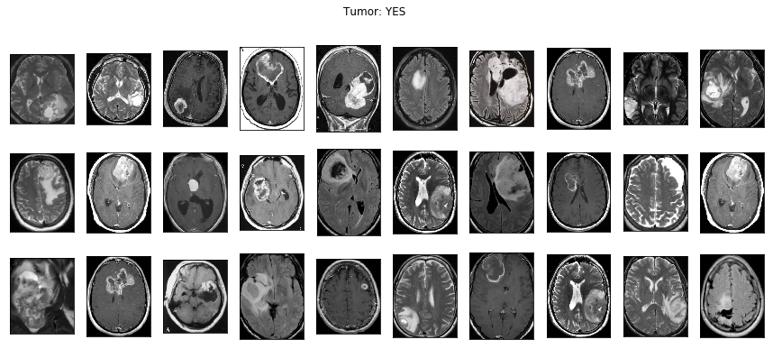

# Brain Tumor Detection Using VGG16

## Overview
This project focuses on detecting brain tumors from MRI scans using deep learning techniques. We employ a **Convolutional Neural Network (CNN)**, specifically leveraging the **VGG-16 model**, to classify MRI images into **tumor** and **non-tumor** categories.

## Dataset & Preprocessing
To enhance model performance, we perform **data augmentation** and **preprocessing** to standardize images before training. Below is an example of the preprocessing step:

## Model Architecture
- **Base Model:** VGG-16 (pretrained on ImageNet)
- **Layers Fine-Tuned:** Fully connected layers adapted for binary classification
- **Optimizer:** Adam
- **Loss Function:** Binary Cross-Entropy

## Training & Results
The model is trained to classify MRI scans into **tumor** and **non-tumor** classes. Below are some sample images from the dataset:

### No Tumor

### Tumor Detected

### Model Performance
Below are the **training accuracy and loss curves**, indicating the model’s learning progress:

### Confusion Matrices
The confusion matrices for the **validation** and **test** datasets are shown below:

#### Validation Set Performance:

#### Test Set Performance:

## Conclusion
The VGG-16 model effectively classifies brain tumor images. Future improvements could include:
- Training on a **larger dataset** for better generalization
- Implementing **hyperparameter tuning** for improved accuracy
- Exploring **alternative CNN architectures** like ResNet or EfficientNet

---

📌 **License:** This project is open-source under the MIT License.
